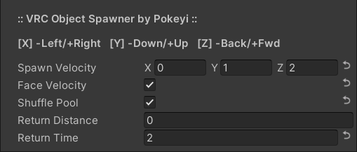

# 🚧 VRC-Object-Spawner 
Network-synced object spawner & controller for VRChat.

## Overview
🚧 This project is functional but in early stages with additional features planned. 🚧

VRC Object Spawner is a single configurable UdonSharp behaviour that can be used to spawn and manage movement of multiple objects simultaneously synchronized to all players.

It is intended to be efficient and relatively simple to use without the need for any additional editor scripts or dependencies outside of UdonSharp. All configuration can be done within the Unity Inspector window without the need for any programming, Udon, or SDK knowledge. That said, the source code is cleanly-organized and commented in the hopes of also being a good learning tool.

### Requirements
Errors regarding functions not being exposed likely mean you need an updated version of the SDK or UdonSharp.
- [VRChat Worlds SDK3](https://vrchat.com/home/download) (Tested: v2021.11.8)
- [UdonSharp](https://github.com/MerlinVR/UdonSharp) (Tested: v0.20.3)

### Optional
Components with functionality supporting this behaviour, should you like to use them.
- [VRC Omni-Action](https://github.com/Pokeyi/VRC-Omni-Action) (Multi-Purpose Function Handler)

### Recommended
Other useful VRChat world-creation tools that I will always recommend.
- [World Creator Assistant](https://github.com/Varneon/WorldCreatorAssistant) (SDK & Package Management)
- [CyanEmu](https://github.com/CyanLaser/CyanEmu) (Unity-Window Testing)

### Setup
Make sure you have already imported the VRChat Worlds SDK and UdonSharp into your project.
- Download the latest [Unity Package](https://github.com/Pokeyi/VRC-Object-Spawner/releases) and import it into your project.
- A pre-configured example prefab is included that you can drop into your scene if you like.
- Create and select an empty game object. I recommend adding the game objects you want to spawn as children of this object. They will spawn from their original transform positions.
- Add the P_ObjectSpawner behaviour via the Unity Inspector window or 'Component > Pokeyi.VRChat > P.VRC Object Spawner' toolbar menu.
- Click the 'Convert to UdonBehaviour' button if prompted.
- If a VRC-Object-Pool component is not already on your game object, one will be added automatically. You will drag your spawnable objects here. More details on this below.
- Click the small triangle next to Pool to expand the array.
- If the Size field is left at 0, you can lock the Inspector tab and drag the spawnable objects into the Pool label to add them all to the array at once. You can alternatively enter a Size value and drag them in one at a time.
- Configure the rest of the behaviour's properties in the Inspector window as you see fit. Each of these is explained in detail further below.

## Features
The main features of the Object Spawner.
- VRC-Object-Pool - A necessary component included with the VRChat SDK that handles a portion of the spawner functionality. (See: [VRChat Docs](https://docs.vrchat.com/docs/network-components#vrc-object-pool))
- Velocity Properties - Properties pertaining to the movement of the objects after they are spawned.
- Return Options - Options for how each spawned object will be returned to the pool.
- Spawner Events - Events called to Spawn objects from the pool or Reset them.

All of the following properties have hover-tooltips in the Unity Inspector window.

### VRC-Object-Pool
The object pool component storing the array of game objects you've selected to be handled by this behaviour. Must be on the same game object as this behaviour.
- Copies of prefabs can not be traditionally instantiated in VRChat, you must pool objects already added to the scene.
- If there are too-few objects available to spawn, the next will be skipped until another is returned. There is no limit imposed on the number of game objects you can add.
- See [Setup](#setup) above for tips on placing game objects into the object pool via the Unity Inspector window.

### Velocity Properties
Properties governing the movement of the objects after they are spawned.
- Spawn Velocity - The speed and direction in which each spawned object will move once it is spawned. This is relative to the spawner itself.
- Face Velocity - Whether each spawned object turns to face its velocity or keeps its original rotation.

### Return Options
Options for how each spawned object will be returned to the pool.
- Shuffle Pool - When all spawnable objects are returned, the object pool order will be shuffled.
- Return Distance - Maximum distance each spawnable object can travel from the source before it is returned.
- Return Time - Maximum time in seconds each spawnable object can be active before it is returned.

### Spawner Events
Events called to Spawn objects from the pool or Reset them. (See: Notes [#1](#notes))
- Call the public "\_SpawnObject" method to spawn the next object from the pool.
- Call the public "\_ResetObjects" method to return all active objects to the pool.
- This can be done without any programming by selecting 'SendCustomEvent(String)' from the dropdown for [UI Events](https://docs.vrchat.com/docs/ui-events).

### Use Case Examples
Basic examples for which you could use a moving object spawner.
- Projectiles
- Moving Obstacles
- Environmental Effects

### Notes
1. Per the VRChat API, public method/event names starting with an "\_Underscore" are protected from remote network calls, necessitating use of a local-only event. Doing this protects them from being called by malicious clients and potentially breaking functionality in your world.

## Credit & Support
Please credit me as Pokeyi if you use my work. I would also love to see your creations that make use of it if you're inclined to share. This and [related projects](https://github.com/Pokeyi/pokeyi.github.io#my-projects) at release have involved over three months of solid work and self-education as I strive for an opportunity to change careers and make a better life for myself. If you find value in my work, please consider supporting me, I appreciate it more than you can imagine!

## License
This work is licensed under the MIT License.

Copyright © 2021 Pokeyi - https://pokeyi.dev - [pokeyi@pm.me](mailto:pokeyi@pm.me)

Permission is hereby granted, free of charge, to any person obtaining a copy
of this software and associated documentation files (the "Software"), to deal
in the Software without restriction, including without limitation the rights
to use, copy, modify, merge, publish, distribute, sublicense, and/or sell
copies of the Software, and to permit persons to whom the Software is
furnished to do so, subject to the following conditions:

The above copyright notice and this permission notice shall be included in all
copies or substantial portions of the Software.

THE SOFTWARE IS PROVIDED "AS IS", WITHOUT WARRANTY OF ANY KIND, EXPRESS OR
IMPLIED, INCLUDING BUT NOT LIMITED TO THE WARRANTIES OF MERCHANTABILITY,
FITNESS FOR A PARTICULAR PURPOSE AND NONINFRINGEMENT. IN NO EVENT SHALL THE
AUTHORS OR COPYRIGHT HOLDERS BE LIABLE FOR ANY CLAIM, DAMAGES OR OTHER
LIABILITY, WHETHER IN AN ACTION OF CONTRACT, TORT OR OTHERWISE, ARISING FROM,
OUT OF OR IN CONNECTION WITH THE SOFTWARE OR THE USE OR OTHER DEALINGS IN THE
SOFTWARE.
